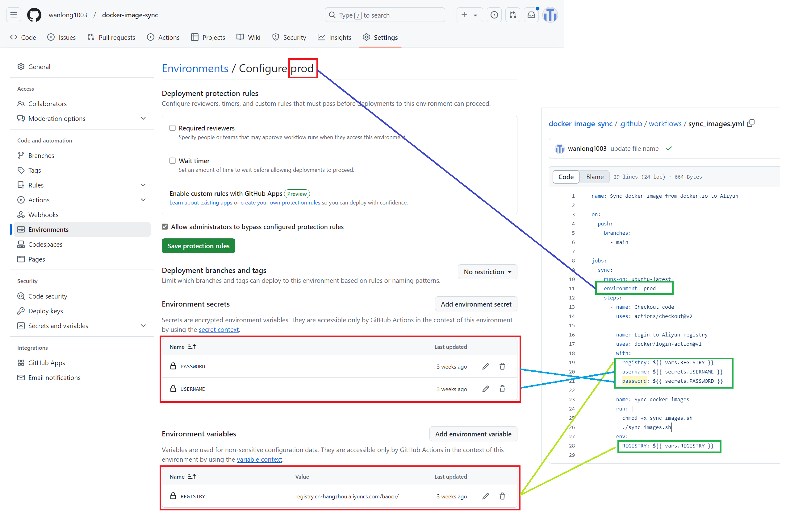

# Docker 镜像同步

将 docker.io 的 镜像同步到 阿里云的容器镜像服务中。可以解决 docker.io 被封无法下载的问题。

## 环境配置
1. 在 `Repository` 的 `Settings` 的 `Environments` 中创建一个 名为 `prod` 的 环境。
2. 创建名为 `USERNAME` 和 `PASSWORD` 的 `Environment secrets`， 值为 `阿里云`>`容器镜像服务`>`访问凭证` 中设置的固定密码。
3. 创建名为 `REGISTRY` 的 `Environment variables`, 值为 阿里云容器实例中的 `公网`。例如: `registry.cn-hangzhou.aliyuncs.com`

如下图所示:

